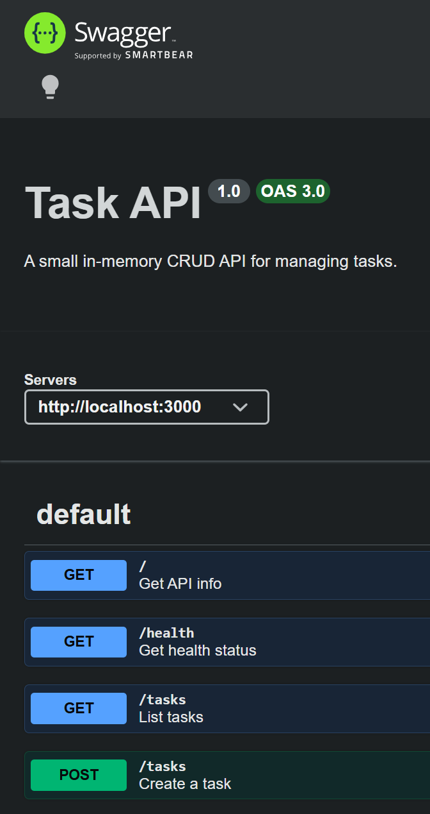

# FlyRank Internship Week 3 Assignment A2

## What this is

This project is a CRUD API for a to-do list that now uses SQLite for persistent storage instead of an in-memory array. The API keeps the same endpoints as the Week 2 version, but tasks now survive server restarts because they live in a local database file.

## Why SQLite?

SQLite was chosen because it is a single-file database with zero setup. It is simple to run locally, creates the database automatically, and works well for small apps and learning projects like this one.

## How to run

From the `to-do list crud api` folder:

```bash
npm start
```

That starts the server on `http://localhost:3000`.

## Database file

The database file is created automatically as `tasks.db` in the project folder. It is created on first run and the `tasks` table is created automatically if it does not already exist. The file is gitignored so each clean clone starts fresh.

## Endpoints

| Method | Route | Purpose | Success status |
| --- | --- | --- | --- |
| GET | `/` | Returns API metadata | `200` |
| GET | `/health` | Returns server health | `200` |
| GET | `/tasks` | Lists all tasks | `200` |
| GET | `/tasks/:id` | Returns one task | `200` |
| POST | `/tasks` | Creates a new task | `201` |
| PUT | `/tasks/:id` | Updates a task | `200` |
| DELETE | `/tasks/:id` | Deletes a task | `204` |

## Example SQL query

```sql
SELECT * FROM tasks;
```

Stage 4 note: I also ran `SELECT COUNT(*) FROM tasks;` in DB Browser, and it returned `3` for the three seeded tasks.

## Swagger UI

Swagger UI is available at `http://localhost:3000/docs/`.



## DB Browser screenshot

Add a screenshot of `tasks.db` open in DB Browser for SQLite here.

## Notes

The API now reads and writes task data from SQLite, so created tasks remain available after a restart. The initial seed runs once and is protected by the database table being empty before insertion.

## AI vs me

I kept the AI-generated variant in `ai-version/` so it stayed separate from the hand-built app.

Prompt used:

> Move an in-memory CRUD task API to SQLite in Node.js using Express and better-sqlite3. Keep the same endpoints and response shapes as the original API: GET /tasks, GET /tasks/:id, POST /tasks, PUT /tasks/:id, DELETE /tasks/:id. Create a tasks table automatically if it is missing, with columns id as an integer primary key, title as text, and done as a boolean stored as 0/1. Seed exactly three example tasks only when the table is empty so the seed never duplicates on restart. Use parameterized SQL queries for all reads, inserts, updates, and deletes. Missing or empty titles must still return 400, unknown ids must return 404 with Task not found, successful create must return 201, successful update must return 200, and successful delete must return 204 with no body. The database should live in tasks.db and be created automatically on first run.

Differences I found:

1. The AI variant used `AUTOINCREMENT` on the primary key, while my version relies on SQLite's default rowid primary-key behavior.
2. The AI variant wrapped seed inserts in a transaction and used tuple-style seed data, while my version keeps the seeding logic in the main storage file alongside the other CRUD helpers.
3. The AI variant returned `Task not found` from the service layer for missing ids, while my hand-built version preserves the original `Task ${id} not found` message in the internal service error path and normalizes the route-level 404 response.